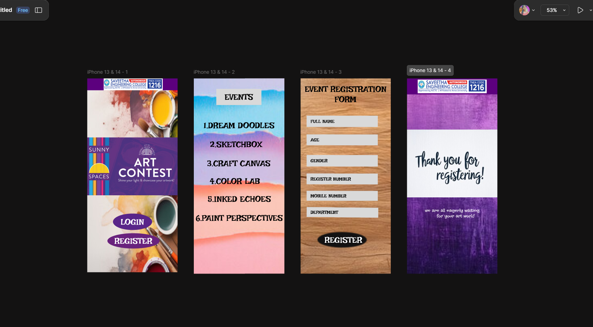

# Ex09 Event Registration Web Application
## Date:20/05/2025
## Name:Nithila S
## Register Number:212224040224

## AIM:
To design, develop and deploy a web application for event registration.

## DESIGN STEPS:

### Step 1:
Create a new frame.

### Step 2:
Select any one preset size of your choice.

### Step 3:
Select the shapes you need.

### Step 4:
Import images as needed.

### Step 5:
Create pages based on your need and link them.

### Step 6:

Validate the HTML and CSS code.

### Step 6:

Publish the website in the given URL.

## DESIGN TOOL:
Figma

## CODE:
home page

  

  
  
  

  
LOGIN

  

  
REGISTER

2nd page

  

  
EVENTS

  
1.DREAM DOODLES

  
2.SKETCHBOX

  
3.CRAFT CANVAS

  
4.COLOR LAB

  
5.INKED ECHOES

  
6.PAINT PERSPECTIVES

3rd page

  
EVENT REGISTRATION

  
FORM

  

  
FULL NAME

  

  
AGE

  

  
GENDER

  

  
REGISTER NUMBER

  

  
MOBILE NUMBER

  

  

  
DEPARTMENT

  

  
REGISTER

4th page

  

  
  
we are all eagerly waiting         for your art work!

  

## OUTPUT:

## RESULT:
The program to design, develop and deploy a web application for event registration is completed successfully.
